.. include:: <isonum.txt>
.. include:: <isogrk1.txt>
.. include:: <isogrk3.txt>
.. include:: <mmlalias.txt>

Lecture 16: Anomaly Detection
=============================
Video 16-1: Problem Motivation
------------------------------

* Like unsupervised problem though some aspects are similar to supervised learning
* Example being discussed of anomaly detection in aircraft engines.

Anomaly detection in aircraft engines
+++++++++++++++++++++++++++++++++++++
Aircraft engine features are :

* :math:`x_1` = heat generated
* :math:`x_2` = vibration intensity

Dataset = :math:`{x^{(1)}, x^{(2)}, ... x^{(m)}}`

New engine rolls of the assembly line: :math:`x_{test}`

Question: Is the new engine anomalous or should it receive further testing as the two possibilities in the following graph.

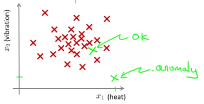

* Assumption is that the dataset provided is non-anomalous or normal

* We need to build a model to predict the probability of the aircraft being appropriate. 
    
    ie. if :math:`p(x_{test}) < \epsilon` *==> then we flag an anomaly*

In the following example, the closer the point is to the inner circle, the higher is the likelihood of it being non-anomalous. On the other hand in the point which is far out (eg. the *x* near the bottom of the image), the likelihood of the engine being anomalous is high.

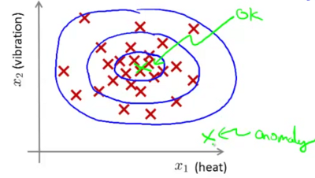

Video 16-2: Anomaly detection example
-------------------------------------

One of the most frequent usages of anomaly detection is that of fraud detection.

* :math:`x^{(i)}` = features of user i's activities
* Model :math:`p(x)` from data
* Identify unusual users by checking which may have :math:`p(x) < \epsilon`

Another use case could be manufacturing (eg. as discussed earlier with aircraft engines).

Anomaly detection can also be used to monitor computers in a data center. eg.

* :math:`x^{(i)}` = features of machine *i*
* :math:`x_1` = memory use
* :math:`x_2` = number of disk accesses / sec
* :math:`x_3` = CPU load
* :math:`x_4` = CPU load / network traffic etc.

Identify machines that are likely to fail and flag off for attention.

Video 16-2: Gaussian Distribution
---------------------------------

.. note:: 
   This is more of an aside video focusing on Gaussian Distribution per se, rather than anomaly detection.

Say :math:`x E \mathbb{R}`. x is a distributed Gaussian with mean :math:`\mu` and variance :math:`\sigma^2`. The distribution is a bell shaped curve centred at :math:`\mu`. :math:`\sigma` (or standard deviation) is indicative of the width of the bell curve.

This is expressed as :math:`x` ~ :math:`N(\mu,\sigma^2)`

The equation for the probability distribution is :

.. math::

   p(x;\mu,\sigma^2) = \frac{1}{\sqrt{2 \pi}\  \sigma} exp\left(- \frac{(x - \sigma)^2}{2 \sigma^2}\right)

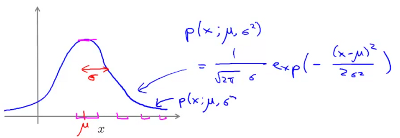

The impact of varying :math:`\mu` and :math:`\sigma^2` on the distribution function is shown in the image below.

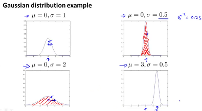

The equation for computing the mean is :

.. math::

   \mu = \frac{1}{m} \sum_{i=1}^m x^{(i)}

The equation for computing the variance is :

.. math::

   \sigma^2 = \frac{1}{m} \sum_{i=1}^m (x^{(i)} - \mu)^2

Video 16-3: Anomaly detection algorithm
---------------------------------------

Density estimation
++++++++++++++++++

Lets say we have a 

* Training set : :math:`{x^{(1)}, ..., x^{(m)}}`, and
* each example is :math:`\left(x \epsilon \mathbb{R}^n\right)` ie. has *n* features.

Assume that each feature is distributed as per gaussian probability distribution. ie. :math:`x_1` ~ :math:`N(\mu_1,\sigma_1^2)` and :math:`x_2` ~ :math:`N(\mu_2,\sigma_2^2)` and so on...

The computed probability is thus

.. math::

   p(x) = p(x_1;\mu_1,\sigma_1^2) *  p(x_2;\mu_2,\sigma_2^2) * ... *  p(x_n;\mu_n,\sigma_n^2) 

.. note::

   Even if the above formula is that for computing probability for independent variables, in practice it works quite well even if the features are not independent.

The above expression could be summarised as 

.. math::

   p(x) = \prod_{j=1}^n p(x_j;\mu_j,\sigma_j^2)

.. note::

   The symbol :math:`\prod_{j=1}^n` is similar to :math:`\sum_{j=1}^n` except that it computes the product of all the values in the series rather than adding them up.

This computation of the probability :math:`p(x)` is often referred to as *Density Estimation*.

1. Choose features :math:`x_i` that you think might be indicative of anomalous examples. Especially choose those for whom either unusually high or unusually low values of :math:`x_i` might be indicative of existence of anomalies.

1. Fit parameters :math:`\mu_1, ..., \mu_n, \sigma_1^2, ..., \sigma_n^2` using

.. math::

   \mu_j = \frac{1}{m} \sum_{i=1}^m x_j^{(i)}

.. math::

   \sigma_j^2 = \frac{1}{m} \sum_{i=1}^m (x_j^{(i)} - \mu_j)^2

The corresponding vectorised implementations is :math:`\mu = \frac{1}{m} \sum_{i=1}^m x^{(i)}` and :math:`\sigma^2 = \frac{1}{m} \sum_{i=1}^m (x^{(i)} - \mu)^2` where :math:`x E \mathbb{R}^n`

1. Given new example :math:`x`, compute :math:`p(x)`

Anomaly detection example
+++++++++++++++++++++++++

Anomaly if :math:`p(x) < \epsilon`

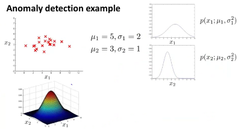

In the above example, :math:`x_1` and :math:`x_2` are two different features. The graphs on the right show their gaussian distribution curves, which are different from each other. 

At the top left is the plot of the known combinations of :math:`x_1` and :math:`x_2` (which of course was used to compute the necessary :math:`\mu` and :math:`\sigma^2` values. 

The figure at the bottom left shows the effective probability of occurrence of particular combinations of :math:`x_1` and :math:`x_2`. Thus any points in this graph where the height of the point on the surface matching the particular point values of :math:`x_1` and :math:`x_2`  is very low, can be viewed as likely anomalous.

Video 16-4: Developing and evaluating an anomaly detection system
-----------------------------------------------------------------

* One of the important aspects of being able to develop an anomaly detection system is being able to first have a way of evaluating the anomaly detection system. This can help decide later whether specific feature additions or removals are actually helping or hurting the anomaly detection system.

* The starting point would be some labeled data of anomalous and non-anomalous data (labels being whether the particular case is anomalous or non-anomalous).

* The training set should consist of the non-anomalous subset of the data referredt to above .. these would be :math:`x^{(1)},x^{(2)}, ..., x^{(m)},` Ideally this data should *not* contain the anomalous data points. However if a few of them do seep through thats probably not such a big deal.

* On the other hand both the cross validation set :math:`(x_{cv}^{(1)},y_{cv}^{(1)}), ..., (x_{cv}^{(m_{cv})},y_{cv}^{(m_{cv})})` and the test set :math:`(x_{test}^{(1)},y_{test}^{(1)}), ..., (x_{test}^{(m_{test})},y_{test}^{(m_{test})})` should contain some elements which are known to be anomalous.

Example : Aircraft Engines
++++++++++++++++++++++++++

Let us consider a scenario where we have data for 10,000 good/normal engines and 20 flawed/anomalous engines. One may want to consider that the data should be split up as follows :

* Training set: 6000 good engines (unlabeled since all are considered good)
* Cross validation set: 2000 good engines, 10 anomalous
* Test set : 2000 good engines, 10 anomalous

Use the training set to compute :math:`\mu_1, \sigma_1^2, \mu_2, \sigma_2^2,...` and thus the density estimation as well, ie. fit the model :math:`p(x)`.

Now on the cross validation/test example :math:`x`, predict, 

.. math::

   y = \left\{\begin{matrix}1 & if p(x) < \epsilon (anomaly) \\0 & if p(x) \geq \epsilon (normal)\end{matrix}\right.

Note: :math:`y` above is a prediction. You can now contrast it with the actual data in your cross validation set. Note that data is extremely skewed ie. #normal points are substantially greater than #anomalous. Thus classification accuracy would not be a good evaluation metric. Instead computing the following might be useful.

* % of True/False +ves/-ves, or 
* Precision / Recall
* :math:`F_1` score

One could attempt to apply different values of :math:`\epsilon` on the cross validation set, and choose the value that maximises the :math:`F_1` score. Finally apply the selected value on the test set, and recompute the metrics above.

Video 16-5: Anomaly Detection vs. Supervised Learning
-----------------------------------------------------

If there is labeled data ie. labeled anomalous or normal, why don't we just use techniques for supervised learning?

* Usually anomaly detection is likely to be useful in scenarios where there is a very very small number of positive (ie. anomalous or :math:`y` = 0) scenarios.
* Anomaly detection might be more useful, where it is hard for an algorithm to learn from positive examples what the anomalies look like (could also cover situations where future anomalies may look nothing like the anomalies we have seen so far).
* Candidate uses for Anomaly detection :  Fraud detection, manufacturing defects, monitoring machines in a data center.
* Candidate uses for supervised learning : Email spam classification, Weather prediction, (sunny / rainy etc)., Cancer classification.

.. note::

   If you are a large online retailer and you have data about a large number of users who have been identified to commit fraud, then fraud detection in such a context might shift to a supervised learning approach rather than an anomaly detection one.

Video 16-6: Choosing what features to use
-----------------------------------------

Non-gaussian features
+++++++++++++++++++++

Would be useful to plot a histogram of various features to get a sense if the features are gaussian. In many situations even if the feature is not showing gaussian distribution, it still might be Ok to consider to go ahead assuming it is so. However sometimes many features show themselves to be substantially non gaussian. In such a situation it might be useful to figure out a transformation to process the feature into a gaussian feature eg. :math:`log(x)` instead of :math:`x`. Other options could be :math:`log(x2 + c)`, :math:`\sqrt{x_3}`, .. etc.

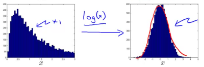

*Above: Transformation of a non-gaussian to a gaussian distribution using log(x)*

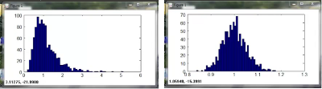

*Above: Transformation using :math:`xNew = x ^\wedge 0.05`*

Error Analysis
++++++++++++++

How does one come up features appropriate for anomaly detection?

* Try to study the features by applying them on the cross validation set.
* You might find situations where say :math:`p(x)` is high for anomalous examples as well. Lets say you find an example where :math:`p(x)` is high for a clearly anomalous situation. Study that particular example to identify perhaps an additional feature that would lead to this particular situation getting flagged as an anomaly.

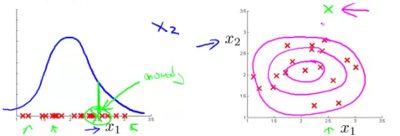

*Above: identifying a new feature by looking at anomalies with a high p(x)*

* Also prefer to choose features that might take on unusually large or small values in event of an anomaly. Let us imagine memory, disk acceses, cpu load and network traffic are features being looked at for monitoring computers in a data center. Lets imagine that anomalies are more likely to occur when the computer gets stuck in a long while loop, in which case the CPU load is likely to be quite high and the network traffic quite low. This is a candidate case for identification of yet another feature which is the ratio of CPU load to network traffic. (or perhaps even square of cpu load to network traffic). This will help you spot anomalies which are based on unusual combination of features.

Video 16-7: Multivariate Gaussian distribution
----------------------------------------------

Sometimes the features have some correlation with each other. 

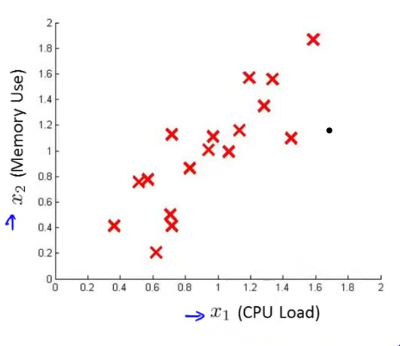

You can see the positive seemingly linear correlation between the two features :math:`x_1` and :math:`x_2`. Yet the algorithm above largely assumed these features to be independent. This creates a difficulty as shown in the diagram below. 

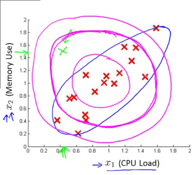

The contours of the probability function computed by independent gaussian variables are similar to the magenta circles drawn above. Yet a casual look can convince us that the contours need to be more along the lines of the contour drawn in the blue line. Thus if you focus on the point marked in green, it should ideally get flagged off as an anomaly, but given the seemingly circular contours, it in this case will not. For this enter - multivariate gaussian distribution.

So for :math:`x \epsilon \mathbb{R}^n`, do not model :math:`p(x_1), p(x_2),...` separately assuming them to be independent variables. Model :math:`p(x)` in one go. The parameters to such computations here are :math:`\mu \epsilon \mathbb{R}^n` and :math:`\Sigma \epsilon \mathbb{R}^{nxn}`. Note that we have now introduced :math:`\Sigma` which is the covariance matrix instead of :math:`\sigma^2` which was just a vector.

In such a case the probability function will be computed as follows :

.. math::

   p(x;\mu,\Sigma) = \frac{1}{(2\pi)^{n/2} |\Sigma|^{1/2}} exp(-\frac{1}{2} (x-\mu)^T \Sigma^{-1} (x - \mu))

where :math:`|\Sigma|` is the determinant of :math:`\Sigma`

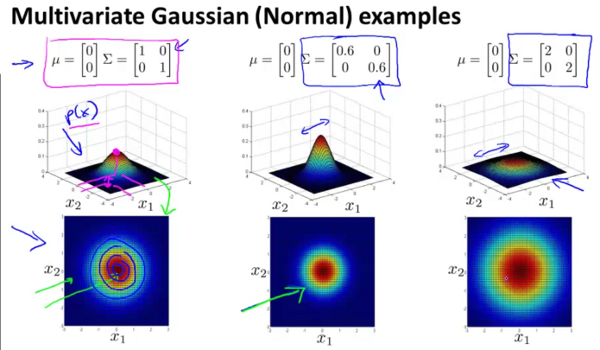

In the figure above it can be seen that by changing the values on the diagonal of the covariance matrix simultaneously, the contours can be made either broader or narrower.

.. image:: images/lecture16/multivariate_gaussian_distribution_2.png

In this figure it can be seen that by independently changing the values on the diagonal of the covariance matrix, the contour profiles can be made to be elliptical along the horizontal and vertical axes.

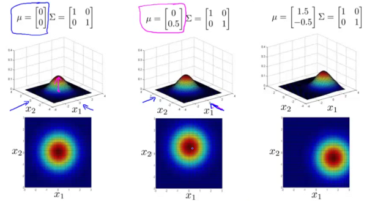

The above figure shows, that by changing the values of :math:`\mu`, the overall position of the contour profile could be moved.

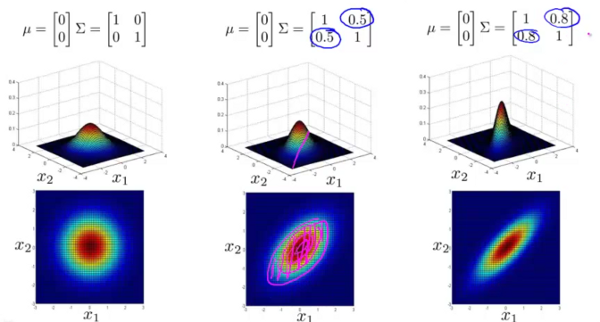

Finally the image above shows that by changing the values on the covariance matrix not on the diagonal, the contour profile changes to an elliptical shape along arbitrary axes. In fact the right most profile is probably closest to the one that we started with. And setting the non-diagonal elements of a correlation matrix to be non-zero is an admission of the fact that these elements are correlated and not independently variable. 

So multivariate gaussian distribution should help us model the situation to better fit the actual behaviour of the two features :math:`x_1` and :math:`x_2` that we started out with. Thus by using the modified probability function above we can better predict anomalies when the features show some correlation within themselves.

Video 16-8: Anomaly detection using the multivariate gaussian distribution
--------------------------------------------------------------------------

In computing the probability function using a multivariate gaussian distribution the following could be used.

.. math::

   p(x;\mu,\Sigma) = \frac{1}{(2\pi)^{n/2} |\Sigma|^{1/2}} exp(-\frac{1}{2} (x-\mu)^T \Sigma^{-1} (x - \mu))

We would need to start by first computing :math:`\mu` and :math:`\Sigma` as follows

.. math::

   \mu = \frac{1}{m} \sum_{i=1}^m x^{(i)}

.. math::

   \Sigma = \frac{1}{m} \sum_{i=1}^m (x^{(i)} - \mu)(x^{(i)} - \mu)^T

Then compute :math:`p(x)`. And flag an anomaly if :math:`p(x) < \epsilon`

Relationship to the original model
++++++++++++++++++++++++++++++++++

It turns out that gaussian distribution is simply a special case of multivariate gaussian distribution with the constraint that all the non-diagonal elements of the covariance matrix should be set to zero.

Howeever gaussian distributed still tends to be used more frequently than its multivariate cousin given that the former is computationally cheaper, and can even deal with situations where :math:`m` (the training set size) is small or even less than :math:`n` (the number of features). If :math:`m \leq n`, multivariate gaussian distribution cannot be used since :math:`\Sigma` is non-invertible. It is preferred to generally have :math:`m \geq 10 n`.

Quite often (as in the case above of the two correlated features), it might still be helpful to model additional features by creating new features eg. :math:`x_1 - x_2` or :math:`\frac{x_1}{x_2}` and using gaussian distribution rather then the multivariate gaussian because of the additional computation complexity or if :math:`m` is not substantially larger than :math:`n`.
