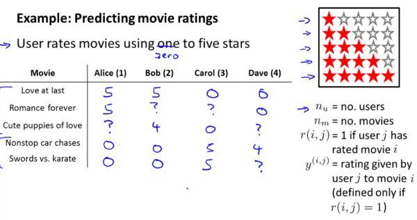
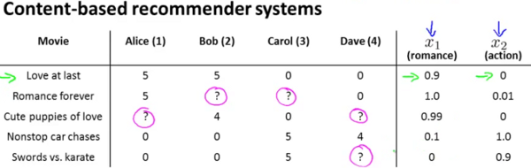
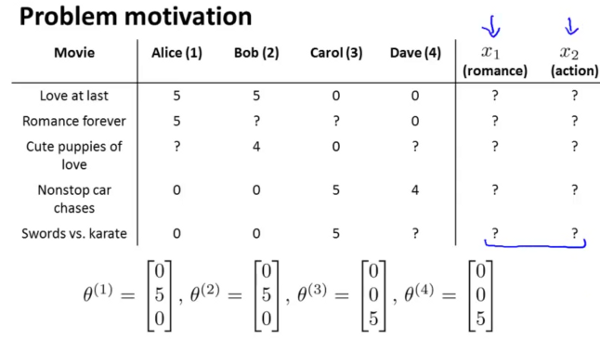
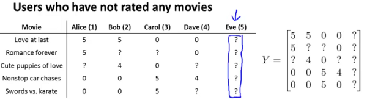
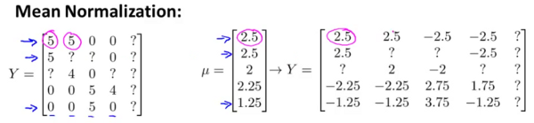

Recommender Systems
===================

Video 17-1: Problem Formulation
-------------------------------

* Many websites in silicon valley attempting to build better recommender systems. eg. Amazon recommends books, Netflix recommends movies etc.
* Often these systems are responsible for influencing a substantial portion of their revenues and thus their bottomlines as well.
* Recommender systems receive relatively little attention within academia but a lot from commercial enterprises.

Predicting movie ratings
++++++++++++++++++++++++

Lets say you allow your users to rate movies using zero (just for the sake of this example) to five stars.

**Notations**

* :math:`n_u` = number of users (
* :math:`n_m` = number of movies
* :math:`r(i,j)` = 1 if user j has rated movie i
* :math:`y^{(i,j)}` = rating given by user j to movie i

In the above example, you might find Alice & Bob giving high ratings to romatic movies and low ratings to action movies. Carol and Dave rate in exactly the opposite manner.

The problem definition is to look through this data and try to predict what the values of the cells with *?* should be. That in turn will form the basis of recommending movies to the users. 

Video 17-2: Content-based recommendation
----------------------------------------

Here's the data.

.. image:: images/lecture17/content_based_recommender_systems.png

In a content based recommender system, one will have features described for the content of the films which can be used in recommendation. Lets introduce two features :math:`x_1 \& x_2` which respectively quantify the extent of romance and action in the movies and provide them appropriate values as follows.

Now one could create a feature vector for the first movie as follows (note an additional feature for the interceptor has been introduced) :

.. math::

   x^{(1)} = \begin{bmatrix}1 \\ 0.9 \\ 0\end{bmatrix}
   x^{(4)} = \begin{bmatrix}1 \\ 0.1 \\ 1.0\end{bmatrix}

For each user :math:`j`, learn a parameter vector :math:`\theta^{(j)} \epsilon \mathbb{R}^3`. Predict user :math:`j` as rating movie :math:`i` with :math:`(\theta^{(j)})^T x^{(i)}` stars.

Lets say we want to predict what Alice will think of Cute puppies of love. The parameter vector for the movie is as follows

.. math::

   x^{(3)} = \begin{bmatrix}1 \\ 0.99 \\ 0\end{bmatrix}

Let us also assume that some as yet unspecified learning algorithm has learned Alice's preferences as the vector :

.. math::

   \theta^{(1)} = \begin{bmatrix}0 \\ 5 \\ 0\end{bmatrix}

The prediction for Alice's rating for Cute puppies of love shall be

.. math::

   (\theta^{(1)})^T x^{(3)}   <== evaluates\ to\ 4.95

Lets also use yet another variable :math:`m^{(j)}` to refer to the number of movies rated by user j. This can be treated as a linear regression problem.

The problem can now be narrowed down to that of minimising over :math:`\theta{(j)}` for 

.. math::

   \frac{1}{2 m^{(j)}} \sum_{i: r(i,j)=1} ((\theta^{(j)})^T(x^{(i)}) - y^{(i,j)})^2 + \frac{\lambda}{2 m^{(j)}} \sum_{k=1}^n (\theta_k^{(j)})^2

Since :math:`m^{(j)}` is a constant here, and one attempts to minimise the optimisation objective, the equation above can be simplified to 

.. math::

   \begin{array}{c}min \\ \theta^{(j)}\end{array} \frac{1}{2} \sum_{i: r(i,j)=1} ((\theta^{(j)})^T(x^{(i)}) - y^{(i,j)})^2 + \frac{\lambda}{2} \sum_{k=1}^n (\theta_k^{(j)})^2

If one wants to simultaneously learn :math:`\theta` for all the users, the optimisation objective :math:`J` which needs to be minimised, can be further stated as 

.. math:: 

   J(\theta^{(1)},...,\theta^{(n_u)}) = \begin{array}{c}min \\ \theta^{(1)},...,\theta^{(n_u)}\end{array} \frac{1}{2} \sum_{j=1}^{n_u} \sum_{i: r(i,j)=1} ((\theta^{(j)})^T(x^{(i)}) - y^{(i,j)})^2 + \frac{\lambda}{2} \sum_{j=1}^{n_u}\sum_{k=1}^n (\theta_k^{(j)})^2
   
This optimisation function can be then used with gradient descent to incrementally obtain the next value of :math:`\theta` as follows :

.. math::

   \begin{array}{l l}
   \theta_k^{(j)} := \theta_k^{(j)} - \alpha \sum_{i:r(i,j)=1} ((\theta^{(j)})^Tx^{(i)} - y^{(i,j)})x_k^{(i)} & (for\ k = 0) \\
   \theta_k^{(j)} := \theta_k^{(j)} - \alpha \left(\sum_{i:r(i,j)=1} ((\theta^{(j)})^Tx^{(i)} - y^{(i,j)})x_k^{(i)} + \lambda\theta_k^{(j)}\right) & (for\ k \ne 0)
   \end{array}

Video 17-3: Collaborative Filtering
-----------------------------------

* This algorithm has an interesting property, *feature learning*, ie. the algorithm learns what features to use.
* In this case (as shown in the image below) we no longer have explicit rating of the features. Instead each user has told us how much they like romance movies and how much they like action movies (via their :math:`\theta` values).

In this case we know the values of :math:`\theta`, but do not know the values of the features :math:`x_1 \& x_2`. The question therefore to be answered is what is the value of the vector :math:`x_1` (or similarly :math:`x_2`) which will satisfy the following equations,

.. math::

   \begin{array}{c}
   (\theta^{(1)})^Tx^{(1)} \approx 5 \\
   (\theta^{(2)})^Tx^{(1)} \approx 5 \\
   (\theta^{(3)})^Tx^{(1)} \approx 0 \\
   (\theta^{(4)})^Tx^{(1)} \approx 0 \\
   \end{array}

Due to the simplicity of this particular problem one can probably reason quickly that the appropriate value would be 

.. math::

   x^{(1)} = \begin{bmatrix}
   1 \\
   1.0 \\
   0.0
   \end{bmatrix}

Stating the problem formally, given :math:`\theta^{(1)},...,\theta^{(n_u)}`, we are required to learn the feature vector :math:`x^{(i)}` such that,

.. math::

   \begin{array}{c}min \\ x^{(i)}\end{array} \frac{1}{2} \sum_{j: r(i,j)=1} ((\theta^{(j)})^T(x^{(i)}) - y^{(i,j)})^2 + \frac{\lambda}{2} \sum_{k=1}^n (x_k^{(i)})^2

Generalising further, across all features, the problem statement now is,  given :math:`\theta^{(1)},...,\theta^{(n_u)}`, we are required to learn the feature vectors :math:`x^{(i)},...x^{(n_m)}` such that,

.. math::

   \begin{array}{c}min \\ x^{(1)},...,x^{(n_m)}\end{array} \frac{1}{2} \sum_{i=1}^{n_m} \sum_{j: r(i,j)=1} ((\theta^{(j)})^T(x^{(i)}) - y^{(i,j)})^2 + \frac{\lambda}{2} \sum_{i=1}^{n_m} \sum_{k=1}^n (x_k^{(i)})^2

In content based rating, we saw that given a value of feature vectors :math:`x`, we could compute :math:`\theta`, while later we saw that given :math:`\theta`, we could compute :math:`x`. Thus it is possible that we may apply these methods alternately to converge these values from a starting random value. ie

.. math::

   \theta \rightarrow x \rightarrow \theta \rightarrow x \rightarrow \theta ....

This mechanism of alternatively applying the transformations is called collaborative filtering.

Video 16-4: Collaborative Filtering Algorithm
---------------------------------------------

Combining the two optimisation objectives shown earlier, the combined optimisation cost function is

.. math::

   J(x^{(1)},...,x^{(n_m)},\theta^{(1)},...,\theta^{(n_u)}) = \frac{1}{2} \sum_{(i,j): r(i,j)=1} ((\theta^{(j)})^T(x^{(i)}) - y^{(i,j)})^2 + \frac{\lambda}{2} \sum_{i=1}^{n_m} \sum_{k=1}^n (x_k^{(i)})^2 + \frac{\lambda}{2} \sum_{j=1}^{n_u} \sum_{k=1}^n (\theta_k^{(j)})^2

And the optimisation exercise shall then be to minimise the cost function as follows 

.. math:: 

   \begin{array}{c}min \\ x^{(1)},...,x^{(n_m)} \\ \theta^{(1)},...\theta^{(n_u)} \end{array} J(x^{(1)},...,x^{(n_m)},\theta^{(1)},...,\theta^{(n_u)}) 

Note that now :math:`x \in \mathbb{R}^n` and :math:`\theta \in \mathbb{R}^n` (earlier it was n+1. There is no reason to hard code an extra feature since the algorigthm is going to learn the feature by itself. If one does want to introduce the feature corresponding to the interceptor, one could always start by specifying :math:`x^{(1)} = 1`

Using the collaborative filter algorithm
++++++++++++++++++++++++++++++++++++++++

To apply the algorithm we shall 

1. Set :math:`x^{(1)},...,x^{(n_m)} \\ \theta^{(1)},...\theta^{(n_u)}` to small random values.
1. Minimise :math:`J` by applying gradient descent (or an advanced optimisation algorithm). Thus

.. math::

   \begin{array}{l}
   for\  every\  j = 1,...,n_u \\
   for\  every\  i = 1,...,n_m \\
   x_k^{(i)} := x_k^{(i)} - \alpha \left(\sum_{j:r(i,j)=1} ((\theta^{(j)})^Tx^{(i)} - y^{(i,j)})x_k^{(i)} + \lambda x_k^{(i)}\right) \\
   \theta_k^{(j)} := \theta_k^{(j)} - \alpha \left(\sum_{i:r(i,j)=1} ((\theta^{(j)})^Tx^{(i)} - y^{(i,j)})x_k^{(i)} + \lambda\theta_k^{(j)}\right)
   \end{array}

As earlier the two terms that we multiply with :math:`\alpha` are the partial derivatives of the cost function. Also note, the special cases such as :math:`x_0` and :math:`\theta_0` are not present.

Once the :math:`\theta` and :math:`x` matrices are known, we can predict that the rating a user :math:`j` assigns to a movie :math:`i` will be :math:`(\theta^{(j)})^T (x^{(i)})`

Video 17-5: Vectorisation and Low Rank Matrix Factorisation
-----------------------------------------------------------

If we model the composite matrices as follows,

.. math::
   \begin{array}{c c}
   X = \begin{bmatrix}
       (x^{(1)}) \\
       (x^{(2)}) \\
        : \\
       (x^{(n_m)})
       \end{bmatrix} &
   \Theta = \begin{bmatrix}
       \theta^{(1)} &
       \theta^{(2)} &
       .... &
       \theta^{(n_u)} 
       \end{bmatrix}
   \end{array}

Then the prediction matrix can simply be written as :math:`X\Theta`. This resultant matrix is a low rank matrix and hence the name *(did not explain what low rank meant)*.

After having learned *n* features, these could theoretically map to romance, action, comedy etc. However in reality, its pretty difficult to derive a human understandable interpretation of what these features are.

The next question we want to focus on is what movies to recommend to a user. In other words, how to find movies *j* related to movie *i*? 

Turns out if we have the corresponding feature vectors for the movies represented as :math:`x^{(i)}` and :math:`x^{(j)}`, and if we identify that the distance between these feature vectors :math:`\|x^{(i)} - x^{(j)}\|` is pretty small, then the two movies are likely to be quite similar.

So if you want to find 5 most similar movies to movie *i*, that would be equivalent to finding the 5 movies *j* with the smallest :math:`\|x^{(i)} - x^{(j)}\|`.

Video 17-6: Implementational detail - Mean normalisation
--------------------------------------------------------

Let us consider a situation where we add a new user *Eve* to the situation we have been discussing so far. Eve has not rated any movies so far.

Recall the cost function we used was

.. math::

   \begin{array}{c}min \\ x^{(1)},...,x^{(n_m)} \\ \theta^{(1)},...\theta^{(n_u)} \end{array} \frac{1}{2} \sum_{(i,j): r(i,j)=1} ((\theta^{(j)})^T(x^{(i)}) - y^{(i,j)})^2 + \frac{\lambda}{2} \sum_{i=1}^{n_m} \sum_{k=1}^n (x_k^{(i)})^2 + \frac{\lambda}{2} \sum_{j=1}^{n_u} \sum_{k=1}^n (\theta_k^{(j)})^2

In this case, since :math:`r(i,j)=1` will not be true for any value of :math:`j=5` since eve has not rated any movies. So the first term in the function above will have not affect :math:`\theta^{(5)}` at all. :math:`\theta^{(5)}` does not appear in the second term. The only place where it will appear is in the third term. as :math:`(\theta^{(j)})^2`. Minimising this will obviously lead to a :math:`\theta^{(5)}` to have all its values being zero. Hence the all the predictions for Eve given by :math:`(\theta^{(5)})^T x^{(i)}` will also have the value zero.

To accomodate for this issue, we will perform mean normalisation as follows. Let us start with a matrix *Y* of all the ratings as shown in the image above. We compute  a vector :math:`\mu` to be the mean of each row in Y. We finally recompute Y by subtracting :math:`\mu` from itself. This is shown in the image below.

Now we can use this matrix for actually learning :math:`\theta^{(j)}` and :math:`x^{(i)}`. But when we have to compute the final prediction, we need to add back :math:`\mu_i` as follows

.. math::
   
   prediction = (\theta^{(j)})^T (x^{(i)}) + \mu_i

As is obvious, :math:`\theta^{(5)}` is still set to all zeroes, but the predictions for eve will no longer be zero. They will be those specified by :math:`\mu`. That seems rather natural, since if we have no idea about a particular new user being introduced, then the prediction we are going to make is that of the average rating.

Note that the technique could also be used to instead account for situations where one introduced a new movie which has no prior ratings and one wanted to predict the ratings for it for each user. But that is rather questionable in the first place, and in any case it is likely to be more important to account for introduction of new users rather than new movies.

